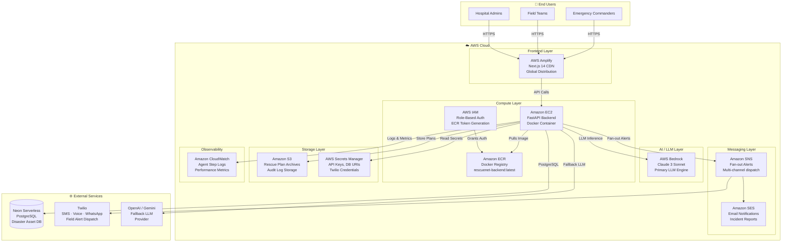

<div align="center">

# 🚨 RescueNet AI

### _When Every Second Counts, AI Coordinates_

**A 10-Agent AI Orchestrator for Real-Time Disaster Response, Survivor Prioritization & Automated Rescue Dispatch**

[](.)
[](.)
[](.)
[](.)
[](.)
[](.)
[](.)
[](.)

---

> **"Imagine 350mm of rain over Hyderabad in 12 hours. Streets are rivers. Thousands are stranded.  
> Command centers are drowning in calls. RescueNet AI turns chaos into a structured rescue plan in under 45 seconds."**

</div>

---

## 📋 Table of Contents

- [🌋 The Problem](#-the-problem)
- [⚡ The Solution](#-the-solution)
- [🏗️ System Architecture](#️-system-architecture)
- [🤖 The 10-Agent AI Pipeline](#-the-10-agent-ai-pipeline)
- [☁️ AWS Infrastructure](#️-aws-infrastructure)
- [📱 Twilio Automation Layer](#-twilio-automation-layer)
- [🗺️ Real Research Datasets — Telangana](#️-real-research-datasets--telangana)
- [🛠️ Tech Stack](#️-tech-stack)
- [🚀 Quick Start](#-quick-start)
- [📂 Repository Structure](#-repository-structure)
- [🔌 API Reference](#-api-reference)
- [⚙️ Configuration](#️-configuration)
- [📚 Key Documents](#-key-documents)
- [🗺️ Roadmap](#️-roadmap)

---

## 🌋 The Problem

When disasters strike — **floods, earthquakes, fires, industrial accidents** — emergency responders face an overwhelming information crisis:

| Pain Point | Impact |
|---|---|
| 🔴 **Siloed Communication** | Fire, medical, and police systems operate on separate channels → delayed coordination |
| 🔴 **Cognitive Overload** | Human commanders process thousands of fragmented reports → critical decision delays |
| 🔴 **Capacity Blindness** | Teams dispatched without real hospital bed data → transport bottlenecks |
| 🔴 **No Survivor Scoring** | No quantitative model to rank who needs help first → rescue by guesswork |
| 🔴 **Manual Alert Drafting** | Operators hand-write SMS and call scripts under extreme stress → errors, delays |

> **Lives are lost not because help isn't available — but because help doesn't reach the right people fast enough.**

---

## ⚡ The Solution

RescueNet AI is a **fully automated multi-agent orchestration system** that transforms a raw incident report into a complete, dispatched rescue plan — entirely through AI collaboration.

```
📡 INCIDENT REPORTED
        ↓  (seconds)
🧠 10 AI AGENTS COLLABORATE IN SEQUENCE
        ↓
📊 SURVIVOR RISK SCORES GENERATED
        ↓
🚒 HOSPITALS & RESOURCES MATCHED FROM REAL DATASETS
        ↓
📋 STRUCTURED RESCUE PLAN JSON PRODUCED
        ↓
📱 AUTOMATED ALERTS DISPATCHED (SMS · WhatsApp · Voice · Dashboard)
```

**End-to-End Time**: `< 1 second (mock)` | `10–45 seconds (live LLM)`

---

## 🏗️ System Architecture

```
┌──────────────────────────────────────────────────────────────────────────────────┐
│                        RESCUENET AI — FULL SYSTEM ARCHITECTURE                    │
└──────────────────────────────────────────────────────────────────────────────────┘

  👤 FIELD TEAMS / COMMANDERS / DISPATCHERS
           │  Browser / Mobile / API
           ▼
  ┌────────────────────────────────────────────────────────────────────────────┐
  │                        AWS AMPLIFY (CDN)                                    │
  │               Next.js 14 Frontend — App Router / TypeScript                │
  │      Dashboard · Incident Form · Live Map · Rescue Plan Viewer             │
  └──────────────────────────────────────┬─────────────────────────────────────┘
                                         │  REST API (HTTPS)
                                         ▼
  ┌────────────────────────────────────────────────────────────────────────────┐
  │                    AMAZON EC2  +  DOCKER  +  ECR                           │
  │               FastAPI Backend — Python 3.11 — Pydantic v2                 │
  │                                                                            │
  │   ┌───────────────┐  ┌──────────────────┐  ┌────────────────────────┐    │
  │   │ REST Routers  │  │  Service Layer   │  │  DB Repository Layer   │    │
  │   │ /incidents    │  │  (Orchestration  │  │  PostgreSQL / Neon     │    │
  │   │ /agents       │  │   & Business     │  │  · incidents           │    │
  │   │ /hospitals    │  │   Logic)         │  │  · rescue_requests     │    │
  │   │ /resources    │  │                  │  │  · agent_decisions     │    │
  │   │ /rescue-plan  │  │                  │  │  · alert_logs          │    │
  │   └───────────────┘  └──────────────────┘  └────────────────────────┘    │
  └──────────────────────────────────────┬─────────────────────────────────────┘
                                         │  Python function call
                                         ▼
  ┌────────────────────────────────────────────────────────────────────────────┐
  │               CREWAI MULTI-AGENT ORCHESTRATION ENGINE                      │
  │                                                                            │
  │  Agent 1  ──▶  Agent 2  ──▶  Agent 3  ──▶  Agent 4  ──▶  Agent 5        │
  │  Disaster      Incident      Survivor       Medical        Priority        │
  │  Intelligence  Understanding Probability    Triage         Ranking         │
  │                                                               │            │
  │                              ┌────────────────┬──────────────┘            │
  │                              ▼                ▼                            │
  │                          Agent 6          Agent 7                         │
  │                          Resource         Hospital                        │
  │                          Allocation       Coordination                    │
  │                              │                │                            │
  │                              └────────┬───────┘                           │
  │                                       ▼                                   │
  │                                   Agent 8                                  │
  │                                   Risk Prediction                          │
  │                                       │                                   │
  │                                       ▼                                   │
  │                                   Agent 9                                  │
  │                                   Communication                            │
  │                                       │                                   │
  │                                       ▼                                   │
  │                                   Agent 10                                 │
  │                                   Command Orchestrator                     │
  │                                       │                                   │
  │                               ┌───────▼───────┐                          │
  │                               │  RESCUE PLAN  │                          │
  │                               │  JSON OUTPUT  │                          │
  │                               └───────────────┘                          │
  │                                                                            │
  │  LLM Provider (env-configurable):                                         │
  │   ● AWS Bedrock (Claude 3 Sonnet) ● OpenAI GPT-4o                        │
  │   ● Google Gemini Pro  ● Ollama (local)  ● Mock (offline)                │
  └──────────────────────────────────────┬─────────────────────────────────────┘
                                         │
               ┌─────────────────────────┼──────────────────────────┐
               ▼                         ▼                          ▼
  ┌────────────────────┐   ┌────────────────────────┐  ┌───────────────────────┐
  │   TWILIO LAYER     │   │   AWS SERVICES         │  │  REAL DATASETS (DB)   │
  │                    │   │                        │  │                       │
  │ · SMS to field     │   │ · S3 (plan storage)    │  │ 547 Hospitals         │
  │   teams via REST   │   │ · SNS (fan-out alerts) │  │ 63  Blood Banks       │
  │ · WhatsApp alerts  │   │ · Bedrock (LLM API)    │  │ 78  Fire Stations     │
  │ · Voice calls to   │   │ · Secrets Manager      │  │ 108 Ambulance Hubs    │
  │   hospital admin   │   │ · ECR (Docker registry)│  │ 33  NDRF Units        │
  │ · TwiML voice      │   │ · CloudWatch (logs)    │  │ 47  Police Stations   │
  │   scripts          │   │ · IAM (auth)           │  │ 29  Disaster Offices  │
  └────────────────────┘   └────────────────────────┘  └───────────────────────┘
```

---

## 🤖 The 10-Agent AI Pipeline

> Each agent passes its **structured JSON output** as context to the next — building a complete picture before the final rescue plan is assembled. No agent invents — every agent enriches.

```
┌──────────────────────────────────────────────────────────────────────────────────┐
│                     RESCUENET AI — 10-AGENT PIPELINE DETAIL                      │
└──────────────────────────────────────────────────────────────────────────────────┘

  📡 RAW INCIDENT REPORT (title, description, location, type)
  │
  ▼
  ╔══════════════════════════════════════════════════════════════════════════╗
  ║  AGENT 1 — DISASTER INTELLIGENCE ANALYST                                ║
  ║  Role:    Classify incident type, severity, and geographic impact zone  ║
  ║  Input:   Raw incident report                                           ║
  ║  Output:  Disaster type · Severity band (1–5) · Impact radius (km)     ║
  ╚══════════════════════════════════════════════════════════════════════════╝
  │  ↓ passes: {disaster_type, severity, impact_radius}
  ▼
  ╔══════════════════════════════════════════════════════════════════════════╗
  ║  AGENT 2 — INCIDENT COMPREHENSION SPECIALIST                            ║
  ║  Role:    Parse fragmented reports into normalized structured data      ║
  ║  Input:   Classified incident from Agent 1                             ║
  ║  Output:  GPS coordinates · Affected population · Infrastructure damage ║
  ╚══════════════════════════════════════════════════════════════════════════╝
  │  ↓ passes: {coordinates, affected_population, damage_level}
  ▼
  ╔══════════════════════════════════════════════════════════════════════════╗
  ║  AGENT 3 — SURVIVOR RISK ESTIMATION SPECIALIST                         ║
  ║  Role:    Calculate survivor probability and people needing rescue      ║
  ║  Input:   Structured incident object, severity score                   ║
  ║  Output:  Survivor probability (0–1) · Estimated count · Time-sensitivity ║
  ╚══════════════════════════════════════════════════════════════════════════╝
  │  ↓ passes: {survivor_probability, estimated_survivors, time_sensitivity}
  ▼
  ╔══════════════════════════════════════════════════════════════════════════╗
  ║  AGENT 4 — MEDICAL EMERGENCY TRIAGE COORDINATOR                        ║
  ║  Role:    Assess medical needs and recommend response level             ║
  ║  Input:   Survivor probability data, incident type                     ║
  ║  Output:  Priority level (critical/high/medium/low) · Trauma types · Resources ║
  ╚══════════════════════════════════════════════════════════════════════════╝
  │  ↓ passes: {medical_priority, trauma_types, resource_needs}
  ▼
  ╔══════════════════════════════════════════════════════════════════════════╗
  ║  AGENT 5 — EMERGENCY RESPONSE PRIORITIZATION OFFICER                   ║
  ║  Role:    Rank incident and determine dispatch urgency                 ║
  ║  Input:   Triage output + survivor probability + incident queue        ║
  ║  Output:  Priority rank (P1–P5) · Urgency score · Response window     ║
  ╚══════════════════════════════════════════════════════════════════════════╝
  │  ↓ branches into parallel tracks:
  ├─────────────────────────────────┐
  ▼                                 ▼
  ╔═══════════════════════════╗   ╔═══════════════════════════════════════╗
  ║  AGENT 6 — RESOURCE       ║   ║  AGENT 7 — HOSPITAL COORDINATION      ║
  ║  ALLOCATION COORDINATOR   ║   ║  LIAISON & BED CAPACITY COORD.        ║
  ║                           ║   ║                                       ║
  ║  Optimal mix of rescue    ║   ║  Best hospitals by proximity,         ║
  ║  teams, vehicles, equip.  ║   ║  capacity & specialization            ║
  ║                           ║   ║                                       ║
  ║  Output:                  ║   ║  Output:                              ║
  ║  · 12 ambulances          ║   ║  · Gandhi Hospital (2.1km, 120 beds) ║
  ║  · 2 rescue helicopters   ║   ║  · Osmania Hospital (3.8km, 80 beds) ║
  ║  · 4 NDRF fire teams      ║   ║  · Patient routing plan              ║
  ╚═══════════════════════════╝   ╚═══════════════════════════════════════╝
  │                                 │
  └──────────────┬──────────────────┘
                 ▼
  ╔══════════════════════════════════════════════════════════════════════════╗
  ║  AGENT 8 — DISASTER RISK FORECASTING ANALYST                           ║
  ║  Role:    Assess secondary risks (aftershocks, flooding, fire spread)  ║
  ║  Input:   Incident type + location + historical data                   ║
  ║  Output:  Risk evolution score · Secondary risk flags · Precautions    ║
  ╚══════════════════════════════════════════════════════════════════════════╝
  │  ↓ passes: {risk_score, secondary_risks[], precautionary_measures[]}
  ▼
  ╔══════════════════════════════════════════════════════════════════════════╗
  ║  AGENT 9 — EMERGENCY COMMUNICATIONS OFFICER                            ║
  ║  Role:    Draft alerts for field teams, hospitals, and public          ║
  ║  Input:   Final rescue plan, recipient types                          ║
  ║  Output:  SMS text · Hospital MCI alert · Public broadcast · TwiML    ║
  ║           → Triggers TWILIO dispatch automatically                    ║
  ╚══════════════════════════════════════════════════════════════════════════╝
  │  ↓ passes: {field_team_sms, hospital_alert, public_message, twiml_script}
  ▼
  ╔══════════════════════════════════════════════════════════════════════════╗
  ║  AGENT 10 — RESCUE COMMAND ORCHESTRATOR                                ║
  ║  Role:    Synthesize ALL 9 agent outputs into one rescue plan          ║
  ║  Input:   Context from ALL prior agents (t1 through t9)               ║
  ║  Output:  Final RescuePlan JSON — the definitive field command         ║
  ╚══════════════════════════════════════════════════════════════════════════╝
  │
  ▼
  ┌──────────────────────────────────────────────────────────────┐
  │                   RESCUE PLAN JSON OUTPUT                     │
  │  {                                                           │
  │    "priority": "P1",                                         │
  │    "severity": 5,                                            │
  │    "affected_area": "Begumpet, Hyderabad",                   │
  │    "estimated_survivors": 4200,                              │
  │    "survivor_probability": 0.72,                             │
  │    "medical_priority": "critical",                           │
  │    "recommended_hospital": "Gandhi Hospital",                │
  │    "recommended_resources": [                                │
  │      {"type": "ambulance", "count": 12, "eta_minutes": 8},  │
  │      {"type": "helicopter", "count": 2, "eta_minutes": 15}, │
  │      {"type": "ndrf_team", "count": 4, "eta_minutes": 22}   │
  │    ],                                                        │
  │    "risk_warnings": ["Flash flood escalation in 6 hrs"],    │
  │    "alert_actions": {                                        │
  │      "field_team": "PRIORITY P1: Deploy immediately...",     │
  │      "hospital": "MCI ALERT: Expect 350 casualties...",      │
  │      "public": "EVACUATION ORDER: Begumpet zone..."          │
  │    }                                                         │
  │  }                                                           │
  └──────────────────────────────────────────────────────────────┘
       │               │               │
       ▼               ▼               ▼
  📱 Twilio SMS   📞 Voice Call   🖥️  Dashboard
  to field teams  to hospitals    real-time update
```

### Agent Context Chaining (How Agents Talk to Each Other)

| Task | Agent | Receives Context From | Key Value Add |
|---|---|---|---|
| Task 1 | Disaster Intelligence | _(Raw report only)_ | Sets disaster classification for all downstream agents |
| Task 2 | Incident Understanding | Task 1 | Converts vague text into GPS + population numbers |
| Task 3 | Survivor Probability | Task 2 | Applies statistical model → survivor count |
| Task 4 | Medical Triage | Task 3 | Translates survivor count into medical resource needs |
| Task 5 | Priority Agent | Tasks 1–4 | Full picture → accurate P1–P5 ranking |
| Task 6 | Resource Allocation | Tasks 4, 5 | Medical needs + priority → correct unit mix |
| Task 7 | Hospital Coordination | Tasks 3, 4, 5 | Routes casualties to real Telangana hospitals |
| Task 8 | Risk Prediction | Tasks 1, 2 | Secondary hazard forecasting from incident type + location |
| Task 9 | Communication | Tasks 5, 6, 7, 8 | Accurate, data-backed alert messages for all recipients |
| Task 10 | Command Orchestrator | Tasks **1–9 ALL** | Synthesizes, not invents — the definitive rescue command |

---

## ☁️ AWS Infrastructure



### AWS Services Breakdown

| Service | Role | Current Status |
|---|---|---|
| **AWS Amplify** | Frontend CDN — Next.js build, SSL, global distribution | ✅ Configured (`amplify.yml`) |
| **Amazon EC2** | FastAPI backend compute host | ✅ Active (`apprunner-config.json`) |
| **Amazon ECR** | Private Docker registry for `rescuenet-backend:latest` | ✅ Integrated |
| **AWS IAM** | Role-based access, short-lived ECR tokens, no hardcoded credentials | ✅ Active |
| **AWS Bedrock** | Primary production LLM (Claude 3 Sonnet) | ⚙️ Configured (env-based) |
| **Amazon SNS** | Fan-out alert dispatch to Twilio, SES, and SMS endpoints | ⚙️ ARN configured |
| **Amazon S3** | Rescue plan JSON storage, audit log archiving | ⚙️ Bucket configured |
| **AWS Secrets Manager** | Secure storage for DB URIs, API keys, Twilio tokens | 🔵 Planned (v0.3) |
| **Amazon CloudWatch** | Agent step logging, performance metrics, alarm triggers | 🔵 Planned (v0.3) |

### Deployment Script

The backend is deployed via `scripts/deploy_to_ec2.ps1`:

```powershell
# 1. Authenticate with AWS IAM → get ECR login token
# 2. Upload execution script to EC2 via SSH
# 3. Auto-install Docker + AWS CLI if missing
# 4. Pull rescuenet-backend:latest from ECR
# 5. Run container with all env vars (DB URI, CORS, LLM keys)
```

```bash
# Full deployment checklist:
# ✅ Push Docker image to Amazon ECR
# ✅ Provision EC2 instance, open port 8000
# ✅ Provision Neon PostgreSQL instance
# ✅ Execute deploy_to_ec2.ps1
# ✅ Connect Amplify to GitHub repo (auto-deploy on push)
# ✅ Set NEXT_PUBLIC_API_URL in Amplify env vars
# ✅ Verify: GET http://<EC2_IP>:8000/health → {"status":"ok"}
```

---

## 📱 Twilio Automation Layer

RescueNet AI uses **Twilio** as the final-mile alert dispatch engine, triggered automatically by Agent 9 (Communication Agent) after the rescue plan is assembled.

```
┌─────────────────────────────────────────────────────────────────────────┐
│                   TWILIO AUTOMATION PIPELINE                             │
└─────────────────────────────────────────────────────────────────────────┘

  Agent 9 (Communication Agent) drafts 3 alert types:

  ┌───────────────────────────────────────────────────────────────────────┐
  │  📱 SMS  →  Field Rescue Teams                                        │
  │  ─────────────────────────────────────────────────────────────────── │
  │  "PRIORITY P1 — BEGUMPET FLOOD: Deploy 12 ambulances + 2 choppers    │
  │   immediately. Survivor est: 4,200. ETA to site: 8 min.              │
  │   Hospital routing: GANDHI (primary) | OSMANIA (overflow).           │
  │   WARNING: Flash flood escalation expected in 6 hours."              │
  │                                                                       │
  │  Sent via: POST https://api.twilio.com/2010-04-01/Accounts/          │
  │            {SID}/Messages.json                                       │
  └───────────────────────────────────────────────────────────────────────┘

  ┌───────────────────────────────────────────────────────────────────────┐
  │  📞 VOICE CALL  →  Hospital MCI Director                              │
  │  ─────────────────────────────────────────────────────────────────── │
  │  TwiML Script:                                                        │
  │  "This is RescueNet AI Emergency Alert. A P1 Mass Casualty           │
  │   Incident has been declared in Begumpet. Gandhi Hospital:           │
  │   Prepare to receive 350 casualties. Trauma and burns primary.       │
  │   ETA first wave: 22 minutes. Activate MCI protocol now."           │
  │                                                                       │
  │  Sent via: Twilio Programmable Voice + TwiML                        │
  └───────────────────────────────────────────────────────────────────────┘

  ┌───────────────────────────────────────────────────────────────────────┐
  │  💬 WHATSAPP  →  Command Center Supervisors                           │
  │  ─────────────────────────────────────────────────────────────────── │
  │  Rich message with incident summary, resource list, hospital routing │
  │  Sent via Twilio WhatsApp Sandbox / Business API                    │
  └───────────────────────────────────────────────────────────────────────┘
```

### Twilio Configuration

```bash
# .env variables required for live Twilio dispatch:
TWILIO_ACCOUNT_SID=AC...            # Your Twilio Account SID
TWILIO_AUTH_TOKEN=...               # Your Twilio Auth Token
TWILIO_WHATSAPP_FROM=whatsapp:+14155238886   # WhatsApp Sandbox number
TWILIO_VOICE_FROM=+1...             # Voice-capable phone number
PUBLIC_URL=https://your-api-url.com  # For TwiML webhook callbacks
SNS_ALERT_TOPIC_ARN=arn:aws:sns:... # AWS SNS for fan-out
```

### Full Automation Trigger Flow

```
POST /api/v1/agents/execute { incident_id }
    → Agent 9 output: { field_team_sms, hospital_twiml, whatsapp_msg }
    → communication_service.dispatch_alerts()
        ├── Twilio SMS API   → field team mobile numbers
        ├── Twilio Voice API → hospital MCI director number
        ├── Twilio WhatsApp  → command center supervisor
        └── AWS SNS publish  → fan-out to additional subscribers
    → alert_logs written to DB (channel, recipient, status, timestamp)
```

---

## 🗺️ Real Research Datasets — Telangana

RescueNet AI is powered by **7 verified emergency asset datasets** compiled from official Telangana government and national emergency management sources. These are not mock data — these are real facility records.

```
┌─────────────────────────────────────────────────────────────────────────┐
│              TELANGANA EMERGENCY ASSET DATABASE                          │
│                    (~905 verified records)                               │
└─────────────────────────────────────────────────────────────────────────┘
```

| Dataset | Records | Source | Coverage |
|---|---|---|---|
| 🏥 **Hospitals** | 547 | Telangana Health Dept. | Gandhi, Osmania, MGM Warangal, NIMS, + district hospitals |
| 🩸 **Blood Banks** | 63 | Indian Red Cross / TNBCS | All 33 districts |
| 🚒 **Fire Stations** | 78 | Telangana State Disaster Response Force | Fire tenders + rescue units per district |
| 🚑 **Ambulance Services** | 108 | GVK EMRI 108 / TSEMS | Dispatch hubs across Telangana |
| 🪖 **NDRF Units** | 33 | National Disaster Response Force | Battalions + rapid deployment teams |
| 👮 **Police Stations** | 47 | Telangana Police | Control rooms + emergency response units |
| 🏢 **Disaster Mgmt. Offices** | 29 | TSSDMA | State + district disaster management authorities |

### Dataset Files in Repository

```
rescuenet-ai/
├── Telangana Hospitals Dataset Compilation.pdf     # 547 hospitals, full metadata
├── Telangana Blood Banks Dataset.pdf               # 63 blood banks across districts
├── Telangana – Fire Stations Dataset.pdf           # 78 fire stations + equipment
├── telangana_ambulance_services.pdf                # 108 GVK EMRI dispatch hubs
├── telangana_ndrf_units.pdf                        # 33 NDRF units + battalion codes
├── telangana_police_stations.pdf                   # 47 stations + control rooms
├── telangana_disaster_management_offices.pdf       # 29 TSSDMA offices
├── emergency_assets_master.csv                     # Consolidated master dataset
└── emergency_assets_clean.csv                      # Cleaned + normalized for DB
```

### Key Facilities Used in Agent Routing

| Facility | Type | District | Role in Rescue Plan |
|---|---|---|---|
| **Gandhi Hospital** | Tertiary (Govt.) | Hyderabad | Primary trauma + burn center |
| **Osmania General Hospital** | Tertiary (Govt.) | Hyderabad | Secondary overflow, general trauma |
| **NIMS** | Super-specialty | Hyderabad | Neurology + critical care overflow |
| **MGM Hospital Warangal** | Tertiary (Govt.) | Warangal | North Telangana primary response |
| **GVK EMRI 108 Hub (Begumpet)** | Ambulance dispatch | Hyderabad | Fastest 108 deployment point |
| **Hyderabad NDRF Battalion** | Rapid rescue team | Hyderabad | Flood + collapse rescue operations |

---

## 🛠️ Tech Stack

| Layer | Technology | Purpose |
|---|---|---|
| **Frontend** | Next.js 14 (App Router), TypeScript, Tailwind CSS | Dashboard, incident form, map view |
| **Backend** | FastAPI, Python 3.11, Pydantic v2, Uvicorn | REST API, validation, orchestration |
| **Agent Engine** | CrewAI (multi-agent framework) | 10-agent sequential pipeline |
| **LLM (Primary)** | AWS Bedrock — Claude 3 Sonnet | Production inference |
| **LLM (Alt.)** | OpenAI GPT-4o / Google Gemini / Ollama | Provider-agnostic fallback |
| **Database** | Neon Serverless PostgreSQL | Incident, rescue plan, asset data |
| **Frontend Hosting** | AWS Amplify | CDN, CI/CD, SSL |
| **Backend Hosting** | Amazon EC2 + Docker | Dedicated compute |
| **Container Registry** | Amazon ECR | Private Docker image hosting |
| **LLM Infrastructure** | AWS Bedrock | Managed LLM API |
| **Alert Fan-out** | Amazon SNS | Multi-channel alert broadcast |
| **SMS / Voice / WhatsApp** | Twilio | Real-time emergency dispatch |
| **Auth & Security** | AWS IAM, Secrets Manager | Credential management |
| **Maps** | Google Maps API | Incident and resource geolocation |
| **Observability** | Amazon CloudWatch | Logs, metrics, alarms |

---

## 🚀 Quick Start

### Prerequisites
- Python 3.11+
- Node.js 18+
- Docker & Docker Compose
- AWS CLI (for deployment)
- LLM API key — OR use `LLM_PROVIDER=mock` for full offline demo

<details>
<summary><b>🛠️ 1. Clone and Configure</b></summary>

```bash
git clone https://github.com/Vikram30069/RescueNet-AI.git
cd RescueNet-AI
cp .env.example .env
# Edit .env: set LLM_PROVIDER, DATABASE_URL, and optionally TWILIO_* keys
```
</details>

<details open>
<summary><b>🐳 2. Run with Docker (Fastest)</b></summary>

```bash
docker-compose up --build
```

| Service | URL |
|---|---|
| 🖥️ Frontend Dashboard | http://localhost:3000 |
| 🔌 Backend API | http://localhost:8000 |
| 📋 Swagger Docs | http://localhost:8000/docs |
| 💓 Health Check | http://localhost:8000/health |

</details>

<details>
<summary><b>💻 3. Run Manually (Local Dev)</b></summary>

**Backend:**
```bash
cd backend
python -m venv venv
venv\Scripts\activate          # Windows
source venv/bin/activate       # Mac/Linux
pip install -r requirements.txt
uvicorn app.main:app --reload --port 8000
```

**Frontend:**
```bash
cd frontend
npm install
npm run dev
```

**Run Agent Pipeline (standalone test):**
```bash
python scripts/run_agents.py
```

**Trigger full demo scenario:**
```bash
python trigger_demo.py
```
</details>

<details>
<summary><b>☁️ 4. Deploy to AWS</b></summary>

```powershell
# Push Docker image to ECR:
aws ecr get-login-password --region us-east-1 | docker login --username AWS --password-stdin <ECR_URI>
docker build -t rescuenet-backend .
docker tag rescuenet-backend:latest <ECR_URI>/rescuenet-backend:latest
docker push <ECR_URI>/rescuenet-backend:latest

# Deploy to EC2:
.\scripts\deploy_to_ec2.ps1

# Frontend: connect AWS Amplify to this GitHub repo
# Set env var: NEXT_PUBLIC_API_URL=http://<EC2_IP>:8000
```
</details>

---

## 📂 Repository Structure

```
RescueNet-AI/
├── 🖥️  frontend/              → Next.js 14 App Router (TypeScript, Tailwind)
├── 🔌  backend/               → FastAPI Python server
│   └── app/
│       ├── routers/           → /incidents /agents /hospitals /resources
│       ├── services/          → Business logic + agent triggering
│       ├── schemas/           → Pydantic request/response models
│       └── db/                → PostgreSQL repository layer
├── 🤖  agents/                → CrewAI multi-agent orchestration
│   ├── definitions/           → 10 agent definition files
│   ├── tasks/                 → Task chain with context passing
│   ├── config/                → LLM provider config (env-based)
│   └── orchestrator.py        → Pipeline runner + rescue plan assembler
├── 🗄️  database/              → SQL schema files
├── 🌱  seed/                  → Demo seed data (SQL + Python)
├── 📜  scripts/               → Developer utilities + EC2 deploy script
├── 📊  docs/                  → Diagrams, architecture references
├── 🗺️  [Telangana Datasets]   → 7 real emergency asset datasets (PDF + CSV)
├── docker-compose.yml
├── amplify.yml                → AWS Amplify CI/CD config
├── apprunner-config.json      → AWS App Runner config
└── .env.example               → All environment variable templates
```

---

## 🔌 API Reference

### Core Endpoints

| Method | Endpoint | Description |
|---|---|---|
| `GET` | `/health` | System health check |
| `POST` | `/api/v1/incidents` | Submit a new incident |
| `GET` | `/api/v1/incidents` | List all incidents |
| `GET` | `/api/v1/incidents/{id}` | Get incident by ID |
| `POST` | `/api/v1/agents/execute` | Trigger 10-agent pipeline |
| `GET` | `/api/v1/rescue-plan/{incident_id}` | Retrieve rescue plan |
| `GET` | `/api/v1/hospitals` | List available hospitals |
| `GET` | `/api/v1/resources` | List available resources |

### Trigger the Full AI Pipeline

```bash
# Step 1: Submit an incident
curl -X POST http://localhost:8000/api/v1/incidents \
  -H "Content-Type: application/json" \
  -d '{
    "title": "Begumpet Flash Flood",
    "description": "350mm rainfall in 12 hours. Thousands stranded.",
    "location": "Begumpet, Hyderabad, Telangana",
    "disaster_type": "flood",
    "severity": 5
  }'

# Step 2: Execute the 10-agent pipeline
curl -X POST http://localhost:8000/api/v1/agents/execute \
  -H "Content-Type: application/json" \
  -d '{"incident_id": "YOUR_INCIDENT_ID"}'

# Response: Full RescuePlan JSON + 10 agent decision logs
```

### Sample Rescue Plan Response

```json
{
  "priority": "P1",
  "severity": 5,
  "affected_area": "Begumpet, Hyderabad",
  "estimated_survivors": 4200,
  "survivor_probability": 0.72,
  "medical_priority": "critical",
  "dispatch_urgency": "immediate",
  "recommended_hospital": "Gandhi Hospital",
  "recommended_resources": [
    {"type": "ambulance", "count": 12, "eta_minutes": 8},
    {"type": "helicopter", "count": 2, "eta_minutes": 15},
    {"type": "ndrf_team", "count": 4, "eta_minutes": 22}
  ],
  "hospitals": [
    {"name": "Gandhi Hospital", "distance_km": 2.1, "available_beds": 120, "patient_routing": 250},
    {"name": "Osmania Hospital", "distance_km": 3.8, "available_beds": 80, "patient_routing": 100}
  ],
  "risk_warnings": ["Flash flood escalation expected in 6 hours", "Structural collapse risk in low-lying zones"],
  "alert_actions": {
    "field_team": "PRIORITY P1: Deploy 12 ambulances + 2 helicopters to Begumpet immediately...",
    "hospital": "MCI ALERT: Gandhi Hospital — expect 350 casualties, trauma + drowning cases...",
    "public": "EVACUATION ORDER: Begumpet zone — move to elevated ground immediately..."
  },
  "agent_decisions": [
    {"step": 1, "agent": "disaster_intelligence", "output": {...}},
    {"step": 2, "agent": "incident_understanding", "output": {...}},
    "... 10 decisions total ..."
  ]
}
```

---

## ⚙️ Configuration

### LLM Provider Selection

```bash
# .env — choose ONE provider:
LLM_PROVIDER=mock      # Offline, instant, deterministic (demo/dev)
LLM_PROVIDER=openai    # OpenAI GPT-4o (requires OPENAI_API_KEY)
LLM_PROVIDER=gemini    # Google Gemini Pro (requires GEMINI_API_KEY)
LLM_PROVIDER=ollama    # Local Ollama (requires ollama running on :11434)
LLM_PROVIDER=litellm   # LiteLLM proxy (multi-provider)
```

| Provider | Avg Pipeline Time | Cost | Best For |
|---|---|---|---|
| `mock` | < 1 second | Free | Development, demos, testing |
| `ollama` | 5–30 seconds | Free (GPU required) | Privacy-first local runs |
| `gemini` | 10–40 seconds | Pay-per-use | Google ecosystem |
| `openai` | 10–45 seconds | Pay-per-use | Highest quality outputs |
| `bedrock` | 10–30 seconds | AWS pricing | Production deployment |

---

## 📚 Key Documents

| Document | Purpose |
|---|---|
| 📋 [AGENTS.md](./AGENTS.md) | All 10 CrewAI agent specs (roles, inputs, outputs) |
| 🏗️ [ARCHITECTURE.md](./ARCHITECTURE.md) | System design, component boundaries |
| ☁️ [AWS_DEPLOYMENT.md](./AWS_DEPLOYMENT.md) | Full AWS cloud deployment guide |
| 🔄 [WORKFLOWS.md](./WORKFLOWS.md) | End-to-end incident workflow with Mermaid diagrams |
| 🔗 [AGENT_DEPENDENCY_GRAPH.md](./AGENT_DEPENDENCY_GRAPH.md) | Agent context chaining visualization |
| 📊 [TASK_CHAINING_REPORT.md](./TASK_CHAINING_REPORT.md) | Technical deep-dive: before/after context passing |
| 🗄️ [DATABASE_SCHEMA.md](./DATABASE_SCHEMA.md) | PostgreSQL table definitions |
| 🔌 [API_SPEC.md](./API_SPEC.md) | REST endpoint contracts + examples |
| 🔍 [PROJECT_AUDIT.md](./PROJECT_AUDIT.md) | Full codebase audit + gap analysis |
| 🚑 [RECOVERY_GUIDE.md](./RECOVERY_GUIDE.md) | How to restore and recover the system |

---

## 🗺️ Roadmap

| Phase | Version | Feature |
|---|---|---|
| ✅ | **v0.1** | 10 CrewAI agents + mock mode + full pipeline + Neon DB + AWS deploy |
| 🔵 | **v0.2** | Live Twilio SMS + Amazon Connect voice calls (wired, not mock) |
| 🔵 | **v0.3** | AWS Bedrock Claude production LLM + Secrets Manager + CloudWatch |
| 🔵 | **v0.4** | Real-time IoT/sensor incident stream + WebSocket live agent progress |
| 🔵 | **v0.5** | ML-based disaster risk forecasting using historical Telangana data |
| 🔵 | **v0.6** | Full interactive map with incident pins + resource/hospital overlays |
| 🔵 | **v1.0** | Production-grade AWS ECS Fargate + RDS + ALB + WAF deployment |
| 🔮 | **v2.0** | Expand beyond Telangana → national NDMA integration |

---

## 👥 User Personas

| Persona | Role | Primary Interface |
|---|---|---|
| **Emergency Commander** | Reviews AI rescue plan, approves dispatch | Dashboard + Rescue Plan Viewer |
| **Field Coordinator** | Receives SMS, coordinates on-ground teams | Twilio SMS + WhatsApp |
| **Hospital Administrator** | Accepts incoming casualty alerts, updates bed count | Voice Call + Dashboard |
| **System Operator** | Manages RescueNet platform, reviews audit logs | Admin Dashboard + API |

---

## 💓 Health Check

```bash
GET http://localhost:8000/health
→ { "status": "ok", "version": "0.1.0", "agents": 10, "mode": "mock" }
```

---

## 📜 License

MIT — Built for India's disaster response ecosystem.

---

<div align="center">

**Built with ❤️ for Telangana · Ready to scale for India**

_RescueNet AI — When every second counts, AI coordinates._

</div>
