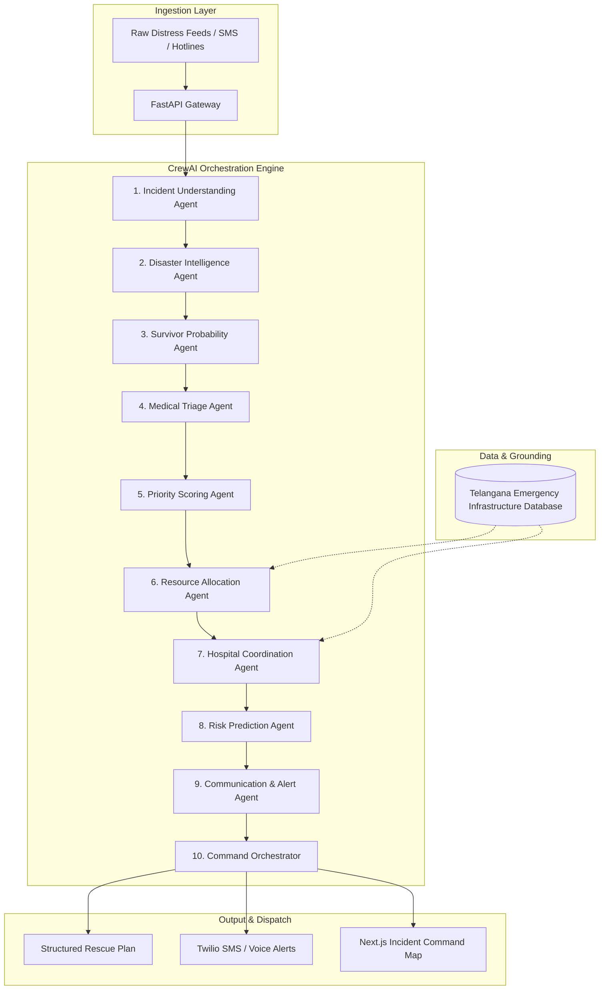

<div align="center">

# 🚨 RescueNet-AI

### Autonomous 10-Agent AI Orchestrator for Real-Time Disaster Coordination

[](https://www.python.org/)
[](https://fastapi.tiangolo.com/)
[](https://www.crewai.com/)
[](https://aws.amazon.com/)
[](Dockerfile)
[](LICENSE)

---

> **"During extreme urban flooding (e.g. 350mm rainfall in Hyderabad), emergency command centers receive thousands of unstructured distress calls. Inter-agency communication between police, fire departments, hospitals, and NDRF collapses into bottlenecks. RescueNet-AI ingests raw distress calls and outputs an optimal, deterministic rescue dispatch plan in under 45 seconds."**

</div>

---

## 1. Overview & Problem

In rapid-onset natural disasters, the critical limiting factor in saving lives is not physical equipment—it is **information synthesis and dispatch latency**:
1. **Unstructured Distress Ingestion**: Distress calls arrive across multiple channels (SMS, voice recordings, emergency hotlines) with noisy, fragmented descriptions.
2. **Triaging Ambiguity**: Operators struggle to differentiate immediate life-threats (trapped infants, severe hypothermia, structural collapse) from general property distress.
3. **Siloed Resource Allocation**: Ambulances, ICU beds, fire tenders, and NDRF rescue boats operate in disjointed databases with zero real-time cross-referencing.

RescueNet-AI solves this through an autonomous, deterministic **10-agent orchestration pipeline**. Each agent executes a single responsibility governed by strict Pydantic input/output schemas to prevent hallucination.

---

## 2. System Architecture



---

## 3. The 10-Agent AI Pipeline

Each agent is built on **CrewAI** with domain-specific system prompts, custom tools, and strict output contracts:

| # | Agent | Responsibility | Core Tools & Inputs | Output Schema Contract |
|---|---|---|---|---|
| **1** | **Incident Understanding** | Extracts coordinates, severity indicators, and hazard type from raw text. | Regex geocoding, text parsers | `hazard_type`, `coordinates`, `urgency_level` |
| **2** | **Disaster Intelligence** | Analyzes weather trends, water level velocity, and infrastructure collapse risk. | Meteorology lookup, historical flood indices | `environmental_risk_index`, `spread_velocity` |
| **3** | **Survivor Probability** | Evaluates time-since-incident, trapped conditions, and environmental exposure. | Survival decay decay curves | `survival_score (0-100)`, `critical_window_mins` |
| **4** | **Medical Triage** | Categorizes trauma, respiratory risk, and pediatric/elderly vulnerabilities. | START triage protocol mapping | `triage_category (RED/YELLOW/GREEN/BLACK)` |
| **5** | **Priority Scoring** | Computes multi-factor rescue priority weighting. | Weighted risk matrix | `composite_priority_score (1-100)` |
| **6** | **Resource Allocation** | Assigns ambulances, boats, power cutters, and NDRF squads from nearest depots. | Geodesic spatial distance calculator | `assigned_resources`, `eta_minutes`, `unit_ids` |
| **7** | **Hospital Coordination** | Matches survivor triage level with live hospital ICU bed & blood bank availability. | Telangana hospital relational registry | `target_hospital_id`, `bed_reserved`, `route_eta` |
| **8** | **Risk Prediction** | Evaluates access route hazards (submerged roads, power lines). | Route obstruction analyzer | `travel_hazards`, `alternative_routes` |
| **9** | **Communication Agent** | Formats emergency SMS, WhatsApp alerts, and synthetic text-to-speech scripts. | Twilio message formatter | `sms_payload`, `ivr_script`, `recipient_list` |
| **10** | **Command Orchestrator** | Synthesizes all agent outputs into an immutable, auditable rescue plan. | Schema validator, consensus aggregator | `final_dispatch_plan`, `audit_trail` |

---

## 4. Emergency Asset Integration (Telangana Region)

RescueNet-AI is grounded in **real, curated emergency infrastructure datasets**:
- **Hospitals & Trauma Centers**: 100+ public and private hospitals across Telangana with ICU capacity, trauma unit capabilities, burn care, and blood bank availability.
- **Ambulance Depots**: 108 Emergency Response Service depots with GPS coordinates.
- **NDRF & SDRF Bases**: National Disaster Response Force battalion depots for flood rescue boat deployment.
- **Fire Stations & Control Rooms**: Regional fire stations equipped with de-watering pumps and specialized hydraulic cutters.

*All data is pre-processed and normalized in `emergency_assets_master.csv` and seeded directly into PostgreSQL / SQLite via `emergency_assets.sql`.*

---

## 5. Technology Stack

- **Backend & API**: Python 3.11, FastAPI, Pydantic v2, SQLAlchemy, Uvicorn
- **AI & Multi-Agent**: CrewAI, LangChain, Amazon Bedrock (Claude 3 / Llama 3)
- **Database**: PostgreSQL (Production) / SQLite (Local Test Mode)
- **Frontend / Command Center**: Next.js 14, Tailwind CSS, Leaflet.js (Geospatial mapping)
- **Telephony & Alerts**: Twilio API (SMS, Programmable Voice IVR, WhatsApp)
- **DevOps & Cloud**: Docker, Docker Compose, AWS EC2, AWS Amplify

---

## 6. Project Structure

```
RescueNet-AI/
├── agents/                     # Multi-Agent Engine
│   ├── config/                 # Agent YAML configuration & prompts
│   ├── definitions/            # 10 Agent class definitions & tool bindings
│   │   ├── incident_understanding.py
│   │   ├── survivor_probability.py
│   │   ├── medical_triage.py
│   │   ├── resource_allocation.py
│   │   ├── hospital_coordination.py
│   │   └── command_orchestrator.py
│   └── orchestrator.py         # Crew execution loop & pipeline coordinator
├── backend/                    # FastAPI REST Application
│   ├── app/
│   │   ├── api/v1/             # Endpoints (incidents, execute, hospitals, plans)
│   │   ├── core/               # Configuration, security, logging
│   │   ├── models/             # SQLAlchemy ORM models
│   │   └── schemas/            # Pydantic v2 request/response contracts
│   ├── tests/                  # Automated Pytest Suite
│   │   ├── test_health.py      # Health & API contract tests
│   │   └── test_notifications.py # Dispatch tests
│   └── Dockerfile              # Backend container definition
├── database/                   # Schema migrations & seed datasets
│   ├── emergency_assets.sql    # Cleaned regional database dump
│   └── emergency_assets_master.csv
├── frontend/                   # Next.js 14 Geospatial Dashboard
├── docker-compose.yml          # Full multi-container orchestration
└── README.md
```

---

## 7. Installation & Quickstart

### Prerequisites
- Python 3.11+
- Docker & Docker Compose (Optional)
- Node.js 18+ (for frontend)

### Local Setup (Backend)

1. **Clone the repository:**
   ```bash
   git clone https://github.com/Vikram30069/RescueNet-AI.git
   cd RescueNet-AI
   ```

2. **Create a virtual environment:**
   ```bash
   python -m venv venv
   source venv/bin/activate  # On Windows: venv\Scripts\activate
   ```

3. **Install dependencies:**
   ```bash
   cd backend
   pip install -r requirements.txt
   ```

4. **Configure environment:**
   ```bash
   cp ../.env.example .env
   ```
   *(Defaults are configured for offline Mock Mode; no paid API keys required for testing)*

5. **Run the API server:**
   ```bash
   uvicorn app.main:app --reload --port 8000
   ```
   - Interactive Swagger API: `http://localhost:8000/docs`
   - Health check: `http://localhost:8000/health`

---

## 8. API Endpoints

| Method | Endpoint | Description |
|---|---|---|
| `GET` | `/health` | Service health status and LLM provider mode |
| `GET` | `/api/v1/incidents` | List active emergency incidents with geo-coordinates |
| `POST` | `/api/v1/incidents` | Report a new incident with severity and casualty estimates |
| `POST` | `/api/v1/agents/execute` | Trigger the 10-Agent pipeline on a specified incident |
| `GET` | `/api/v1/rescue-plan/{id}` | Retrieve generated multi-agency dispatch and hospital plan |
| `GET` | `/api/v1/hospitals` | Query available hospitals filtered by trauma/burn/ICU capacity |
| `GET` | `/api/v1/resources` | Query emergency response assets filtered by vehicle/personnel type |

---

## 9. Automated Testing

RescueNet-AI includes a comprehensive automated test suite verifying API schema contracts, agent handoffs, and resource filters:

```bash
cd backend
pytest tests/ -v
```

**Test Coverage Highlights:**
- `test_health_check`: Validates API availability and LLM configuration.
- `test_agent_execute_with_seed_incident`: Verifies that the 10-agent pipeline produces all required rescue plan schema fields (`priority`, `recommended_hospital`, `recommended_resources`, `alert_actions`).
- `test_create_incident_validation_error`: Ensures Pydantic rejects out-of-bound severity scores.

---

## 10. Limitations & Production Roadmap

- **Offline Mock LLM Fallback**: When live AWS Bedrock or OpenAI credentials are not configured, the system gracefully falls back to deterministic rule-based heuristic agents for local evaluation.
- **Current Limitations**: Operates on simulated incoming distress queues rather than a live 112 emergency telephone PBX line.
- **Future Roadmap**:
  - Integration with Kafka event streaming for handling 50,000+ simultaneous distress pings.
  - Edge offline deployment on ruggedized satellite-linked field laptops.

---

## 11. License

This project is licensed under the MIT License — see the [LICENSE](LICENSE) file for details.
