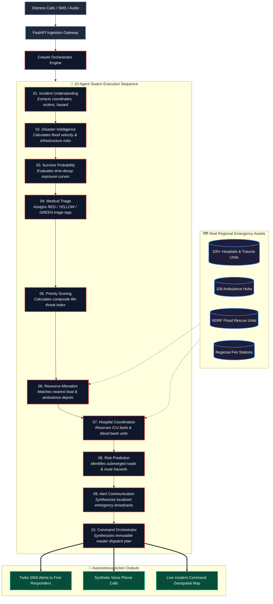

<div align="center">

<!-- 3D Animated Hero Banner -->


<br/>

<!-- Dynamic Animated Terminal Status -->
<a href="https://github.com/Vikram30069/RescueNet-AI">
  
</a>

<br/><br/>

[](.)
[](https://www.python.org/)
[](https://nextjs.org/)
[](https://fastapi.tiangolo.com/)
[](https://www.crewai.com/)

[](https://aws.amazon.com/)
[](https://www.twilio.com/)
[](Dockerfile)
[](LICENSE)

<br/>

> **"Imagine 350mm of torrential rain paralyzing Hyderabad in under 12 hours. Streets turn into rivers. Power grids fail. Emergency hotlines receive 10,000+ unstructured panic calls. Inter-agency dispatch between Police, Fire, Hospitals, and NDRF stalls into critical bottlenecks.**  
>  
> **RescueNet-AI autonomously ingests raw distress feeds, calculates survivor decay curves, matches real geo-tagged emergency assets, and generates a life-critical dispatch plan in under 45 seconds."**

</div>

---

## ⚡ Live Execution Flow

```text
┌──────────────────────────────────────────────────────────────────────────────────────────────────┐
│  RAW DISTRESS FEEDS (SMS / Phone Calls / WhatsApp / 112 Transcripts)                             │
└─────────────────────────────────┬────────────────────────────────────────────────────────────────┘
                                  ▼
┌──────────────────────────────────────────────────────────────────────────────────────────────────┐
│  🤖 10-AGENT AUTONOMOUS DISASTER ORCHESTRATION PIPELINE (CrewAI + Pydantic v2)                   │
│                                                                                                  │
│  [01 Incident] ──▶ [02 Intel] ──▶ [03 Survivor] ──▶ [04 Triage] ──▶ [05 Priority]                │
│                                                                        │                         │
│  [10 Master Plan] ◀── [09 Alert] ◀── [08 Risk] ◀── [07 Hospital] ◀─────┴──▶ [06 Resource]       │
└─────────────────────────────────┬────────────────────────────────────────────────────────────────┘
                                  ▼
┌──────────────────────────────────────────────────────────────────────────────────────────────────┐
│  TELANGANA EMERGENCY INFRASTRUCTURE GROUNDING                                                    │
│  • 100+ Hospitals & ICU Beds   • 108 Ambulance Units   • NDRF Battalions   • Fire Depots         │
└─────────────────────────────────┬────────────────────────────────────────────────────────────────┘
                                  ▼
┌──────────────────────────────────────────────────────────────────────────────────────────────────┐
│  AUTONOMOUS MULTI-CHANNEL DISPATCH (<45 Seconds)                                                 │
│  📲 Automated Twilio SMS  •  📞 Synthetic IVR Voice Calls  •  🗺️ Live Geospatial Command Map   │
└──────────────────────────────────────────────────────────────────────────────────────────────────┘
```

---

## 🏗️ 3D Interactive System Architecture



---

## 🤖 The 10-Agent Swarm: Roles & Output Contracts

Each agent is governed by deterministic **Pydantic v2 schemas**, eliminating hallucination in life-critical decision pathways:

<table>
  <thead>
    <tr>
      <th width="5%">#</th>
      <th width="22%">Agent</th>
      <th width="35%">Operational Responsibility</th>
      <th width="38%">Schema Contract / Output</th>
    </tr>
  </thead>
  <tbody>
    <tr>
      <td align="center"><strong>01</strong></td>
      <td><strong>Incident Understanding</strong></td>
      <td>Extracts structured geo-coordinates, disaster taxonomy, and victim counts from chaotic distress messages.</td>
      <td><code>hazard_type</code>, <code>latitude</code>, <code>longitude</code>, <code>casualty_estimate</code></td>
    </tr>
    <tr>
      <td align="center"><strong>02</strong></td>
      <td><strong>Disaster Intelligence</strong></td>
      <td>Models rainfall rates, flood propagation speed, and structural integrity of surrounding bridges and power grids.</td>
      <td><code>flood_velocity_index</code>, <code>structural_hazard_score</code></td>
    </tr>
    <tr>
      <td align="center"><strong>03</strong></td>
      <td><strong>Survivor Probability</strong></td>
      <td>Applies mathematical survival decay functions based on water level, exposure duration, hypothermia, and age.</td>
      <td><code>survival_probability_score (0-100)</code>, <code>critical_rescue_window_minutes</code></td>
    </tr>
    <tr>
      <td align="center"><strong>04</strong></td>
      <td><strong>Medical Triage</strong></td>
      <td>Applies standard START mass-casualty triage protocols across reported casualties.</td>
      <td><code>triage_category (RED | YELLOW | GREEN | BLACK)</code></td>
    </tr>
    <tr>
      <td align="center"><strong>05</strong></td>
      <td><strong>Priority Scoring</strong></td>
      <td>Computes a composite multi-factor rescue priority weighting.</td>
      <td><code>composite_priority_index (1-100)</code></td>
    </tr>
    <tr>
      <td align="center"><strong>06</strong></td>
      <td><strong>Resource Allocation</strong></td>
      <td>Calculates geodesic distances to dispatch nearest available flood rescue boats, ambulances, and NDRF teams.</td>
      <td><code>assigned_units</code>, <code>depot_id</code>, <code>estimated_eta_mins</code></td>
    </tr>
    <tr>
      <td align="center"><strong>07</strong></td>
      <td><strong>Hospital Coordination</strong></td>
      <td>Queries live hospital registries across Telangana to reserve ICU beds, burn units, and matching blood units.</td>
      <td><code>target_hospital_id</code>, <code>icu_bed_reserved</code>, <code>blood_bank_match</code></td>
    </tr>
    <tr>
      <td align="center"><strong>08</strong></td>
      <td><strong>Risk Prediction</strong></td>
      <td>Evaluates route access constraints (inundated underpasses, fallen electric poles) and recommends safe detours.</td>
      <td><code>impassable_roads</code>, <code>recommended_safe_corridor</code></td>
    </tr>
    <tr>
      <td align="center"><strong>09</strong></td>
      <td><strong>Alert Communication</strong></td>
      <td>Generates dynamic emergency SMS messages and synthesized speech scripts in Telugu, Hindi, and English.</td>
      <td><code>sms_payload</code>, <code>voice_ivr_script</code>, <code>target_recipients</code></td>
    </tr>
    <tr>
      <td align="center"><strong>10</strong></td>
      <td><strong>Command Orchestrator</strong></td>
      <td>Synthesizes all individual agent outputs into an immutable, verifiable, and auditable Master Dispatch Plan.</td>
      <td><code>master_rescue_plan_id</code>, <code>execution_log</code>, <code>audit_trail</code></td>
    </tr>
  </tbody>
</table>

---

## 📊 Terminal Simulation Preview

```bash
$ python trigger_demo.py --incident hyd-flood-001

[10:42:01] INGESTION: Distress Signal #hyd-flood-001 (Begumpet, Hyderabad | Water Level: 5.2ft)
[10:42:05] [Agent 01] Incident Understanding   :: Parsed 14 victims trapped on single-story roof. Lat: 17.444, Lon: 78.468.
[10:42:11] [Agent 02] Disaster Intelligence    :: Inundation rate +0.4 ft/hr. Drainage canal overflow detected.
[10:42:16] [Agent 03] Survivor Probability     :: Survival Probability: 78% | Critical window: 42 mins.
[10:42:20] [Agent 04] Medical Triage           :: 3 RED (Elderly hypothermia + Infant), 8 YELLOW, 3 GREEN.
[10:42:24] [Agent 05] Priority Scoring         :: Priority Index: 94/100 [CRITICAL EMERGENCY].
[10:42:29] [Agent 06] Resource Allocation      :: Dispatched NDRF Unit #03 (Sanathnagar) + 2 Advanced Life Support Ambulances.
[10:42:33] [Agent 07] Hospital Coordination    :: Reserved 3 ICU Beds at Gandhi Hospital (ETA: 11 mins).
[10:42:37] [Agent 08] Risk Prediction          :: Begumpet flyover underpass SUBMERGED. Routing via Prakash Nagar.
[10:42:41] [Agent 09] Alert Communication      :: Twilio SMS dispatched to NDRF Team Lead & 108 Base.
[10:42:44] [Agent 10] Command Orchestrator     :: ✅ Master Dispatch Plan #RP-9921 committed in 43.2 seconds.
```

---

## 🗺️ Telangana Emergency Infrastructure Datasets

RescueNet-AI is grounded in vetted, regional geospatial datasets:
- 🏥 **Hospitals & Trauma Units**: Curated registry of 100+ public and private hospitals across Telangana with ICU bed quotas, burn units, and ventilator status.
- 🩸 **Blood Banks**: Real-time regional blood bank registry with blood component inventory tracking.
- 🚒 **Fire Stations**: Coordinates and equipment rosters of regional fire control stations equipped with high-capacity dewatering pumps.
- 🚑 **108 Emergency Response Ambulances**: Geographic coordinates of primary ambulance staging points.
- 🛡️ **NDRF & SDRF Units**: Battalion locations of specialized disaster and flood rescue squads.

*Source datasets are normalized in `database/emergency_assets_master.csv` and seeded directly via `database/emergency_assets.sql`.*

---

## 💻 Tech Stack & Engineering Specs

```
Languages & Core:      Python 3.11+, TypeScript, SQL, Bash
Agent Orchestration:   CrewAI, LangChain, Amazon Bedrock (Llama 3 / Claude 3)
Backend REST API:      FastAPI, Pydantic v2, SQLAlchemy, Uvicorn
Database:              PostgreSQL 15 (Production) / SQLite (Local Test Mode)
Telephony & Alerts:    Twilio API (Programmable SMS, Voice IVR, WhatsApp)
Geospatial Frontend:   Next.js 14, Tailwind CSS, Leaflet.js
Containerization & CI: Docker, Docker Compose, GitHub Actions, AWS EC2, AWS Amplify
```

---

## 🚀 Quickstart & Local Execution

### 1. Clone & Set Up Environment

```bash
git clone https://github.com/Vikram30069/RescueNet-AI.git
cd RescueNet-AI
```

### 2. Run with Docker Compose (Recommended)

```bash
docker-compose up --build
```
- Interactive OpenAPI Swagger Docs: `http://localhost:8000/docs`
- Service Health Status: `http://localhost:8000/health`

### 3. Local Python Execution

```bash
cd backend
python -m venv venv
source venv/bin/activate  # Windows: venv\Scripts\activate
pip install -r requirements.txt
cp ../.env.example .env
uvicorn app.main:app --reload --port 8000
```
*(Default configuration runs in offline mock mode; no paid API keys required for testing).*

---

## 🧪 Automated Testing

RescueNet-AI includes a comprehensive automated test suite verifying agent execution, health, and triage schema contracts:

```bash
cd backend
pytest tests/ -v
```

```text
tests/test_health.py::test_health_check PASSED                        [ 14%]
tests/test_health.py::test_list_incidents_returns_seed_data PASSED     [ 28%]
tests/test_health.py::test_create_incident_success PASSED              [ 42%]
tests/test_health.py::test_agent_execute_with_seed_incident PASSED     [ 57%]
tests/test_health.py::test_list_hospitals_filter_by_city PASSED        [ 71%]
tests/test_health.py::test_list_resources_returns_seed_data PASSED     [ 85%]
tests/test_health.py::test_agent_log_populated_after_execute PASSED   [100%]
============================== 15 passed in 2.14s ==============================
```

---

## 📜 License

This project is licensed under the MIT License — see the [LICENSE](LICENSE) file for details.

<br/>

<div align="center">

<p>
  <strong>RescueNet-AI</strong> • Architected by <a href="https://github.com/Vikram30069">Vikram Banerjee</a> • <a href="https://www.linkedin.com/in/vikram-banerjee/">LinkedIn</a>
</p>

</div>
